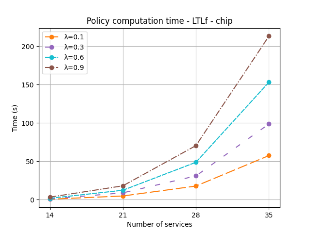
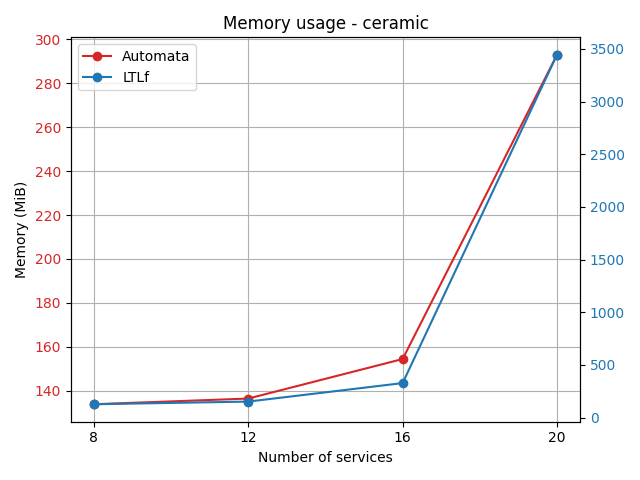
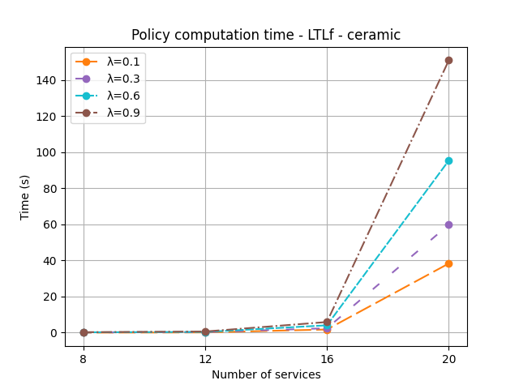
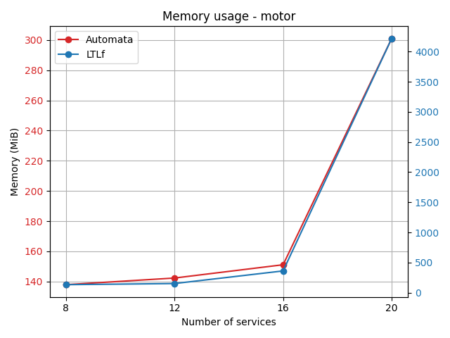
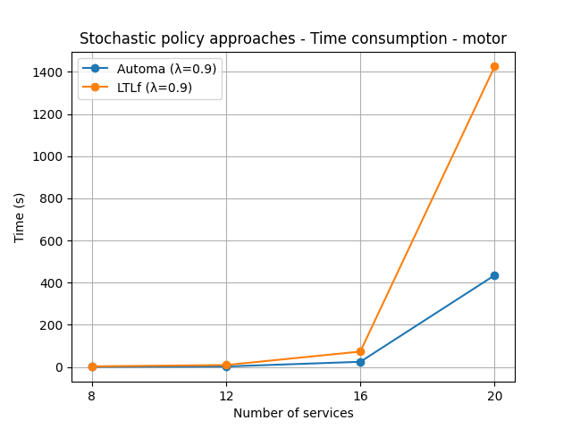
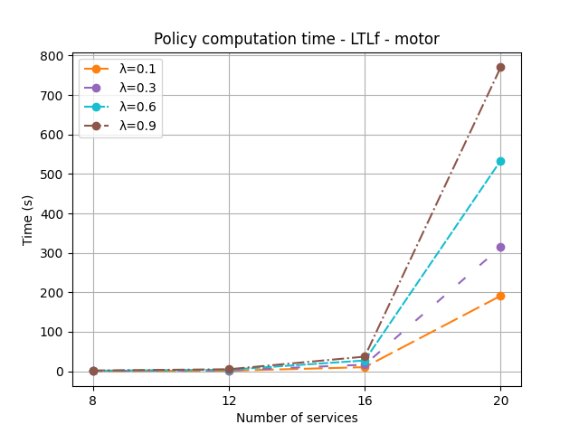

# Orchestration of services in Smart Manufacturing through automated synthesis - Stochastic policy-based approaches

Repository containing the case studies and the experimental results of the stochastic policy-based approaches (target automata and LTLf) for the paper "Orchestration of services in Smart Manufacturing through automated synthesis".

## Experiments

The experiments can be replicated using Docker.

### Use the Docker image

1. Build the image from the [Dockerfile](Dockerfile):
  ```sh
  docker build -t mdp_controller .
  ```

2. Run a new container and open a terminal from the created image:
  ```sh
  docker run mdp_controller bash
  ```

3. Set up the configuration file needed for the controller.

4. Each folder containing sources for the three case studies, contains the script to run the controller in that scenario:
  ```sh
  cd src/ceramic    # to execute the controller in the ceramic scenario
  cd src/chip       # to execute the controller in the chip scenario
  cd src/motor      # to execute the controller in the motor scenario
  python3 main.py 
  ```

5. When the controller finishes its execution, it produces three log files (for each run) in the `experimental_results` folder for each case study. These files represent:
- `<timestamp>_memory_profiler_composition_<mode>_<size>_<gamma>`: contains the memory consumption of the composition computation
- `<timestamp>_memory_profiler_policy_<mode>_<size>_<gamma>`: contains the memory consumption of the policy computation
- `<timestamp>_time_profiler_<mode>_<size>_<gamma>`: contains the execution time of the script

#### Configuration file
The configuration file  `config.json` in each case study folder, contains basic information needed to run the experiments. 

It contains the basic information needed to run the experiments. The JSON key ``mode`` accept the values ``[automata, ltlf]``, the key ``size`` accepts ``[xsmall, small, medium, large]`` values (related to the number of involved actors), the key ``gamma`` relates to the discount factor to use for the computation of the solution, and the key ``serialize`` is a boolean to indicates if serialization is needed or not (it can be skipped).

An example with information of the key-value pairs is given below.
```json
{
    "mode": "ltlf",
    "size": "xsmall",
    "gamma": 0.9,
    "serialize": false
}
```

## Evaluation Results

Evaluation results of the experiments can be found in [src/eval_utils](src/eval_utils/). The [experimental_results.csv](src/eval_utils/experimental_results.csv) file contains the aggregated results of the memory and time consumption for the three case studies.

**Comulative results (including also instance plannin-based approach) are available [here](https://github.com/iaiamomo/TSC-planning-experiments).**


### Chip case study

#### Memory consumption


#### Time consumption


#### Gamma experiments of LTLf mode



### Ceramic case study

#### Memory consumption


#### Time consumption


#### Gamma experiments of LTLf mode



### Motor case study

#### Memory consumption


#### Time consumption


#### Gamma experiments of LTLf mode
